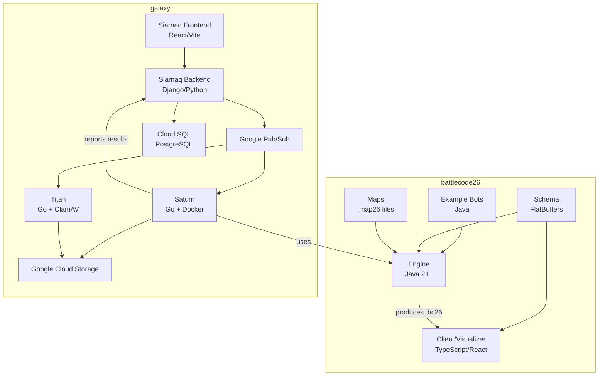

# Architecture Audit — CU Battlecode

> Audit Date: 2026-10-06  
> Status: Phase 0 Complete

---

## 1. Repository Overview

### 1.1 battlecode26 — The Game

| Property | Value |
|---|---|
| **Repo URL** | `https://github.com/battlecode/battlecode26.git` |
| **Branch** | `master` |
| **License** | GPL-3.0 (engine) |
| **Purpose** | Game engine, example bots, visualizer client, serialization schema, game specs |
| **Language** | Java 21+ (engine), TypeScript/React (client), FlatBuffers (schema) |

#### Directory Structure

```
battlecode26/
├── engine/               # Java game engine (core)
│   └── src/
│       ├── main/battlecode/
│       │   ├── common/       # Public API: RobotController, GameConstants, UnitType, etc.
│       │   ├── server/       # Match server: Main, Server, GameMaker, Config
│       │   ├── world/        # Game world: GameWorld, LiveMap, InternalRobot, RobotControllerImpl
│       │   ├── instrumenter/ # Bytecode instrumentation & sandboxing
│       │   ├── crossplay/    # Python cross-play support
│       │   ├── schema/       # FlatBuffers schema Java bindings
│       │   ├── doc/          # Javadoc taglets
│       │   └── util/         # Utilities
│       └── test/             # Engine tests
├── client/               # TypeScript/React visualizer (Webpack + Electron/Tauri)
│   ├── src/              # Web client source
│   ├── src-electron/     # Electron desktop app
│   └── src-tauri/        # Tauri desktop app (Rust)
├── schema/               # FlatBuffers schema definition
│   ├── battlecode.fbs    # Core schema (events, actions, map, round data)
│   ├── java/             # Generated Java bindings
│   ├── js/               # Generated JS bindings
│   ├── ts/               # Generated TS bindings
│   └── python/           # Generated Python bindings
├── example-bots/         # Example bot code (examplefuncsplayer)
├── specs/                # Game specification PDF
├── maps/                 # 74 pre-built map files (.map26)
├── javadoc/              # Generated API documentation
├── build.gradle          # Root build file
├── gradle.properties     # Default match config (teams, maps, etc.)
├── docker-compose.yml    # Legacy Docker setup (frontend/backend/compile/game)
└── gradlew / gradlew.bat # Gradle wrapper
```

#### Game Theme — Battlecode 2026

- **Theme**: Rats vs Cats
- **Unit Types**: `BABY_RAT` (1x1), `RAT_KING` (3x3), `CAT` (2x2)
- **Resource**: Cheese (collected, transferred, spent)
- **Map**: Grid-based (20-60 tiles wide/tall), walls, dirt, cheese mines, traps
- **Phases**: Cooperation mode → Backstab mode
- **Communication**: Squeaks (broadcast), Shared Array (64 slots, rat kings only write)
- **Victory**: Rat King destroyed, more points, more robots, more cheese, coin flip
- **Max Rounds**: 2000
- **Bytecode Limits**: Baby Rat 17500, Rat King 20000, Cat 17500
- **Max Team Execution Time**: 1200s (ns precision)

---

### 1.2 galaxy — The Infrastructure Platform

| Property | Value |
|---|---|
| **Repo URL** | `https://github.com/battlecode/galaxy.git` |
| **Branch** | `main` |
| **License** | MIT |
| **Purpose** | Competitor dashboard, bot compilation, match execution, malware scanning |
| **Languages** | Python/Django (backend), TypeScript/React (frontend), Go (Saturn/Titan) |

#### Directory Structure

```
galaxy/
├── backend/              # Siarnaq — Django REST API backend
│   ├── siarnaq/
│   │   ├── api/
│   │   │   ├── compete/  # Matches, submissions, scrimmages
│   │   │   ├── episodes/ # Game episodes/seasons
│   │   │   ├── teams/    # Team management
│   │   │   └── user/     # User management, auth
│   │   ├── bracket/      # Tournament brackets
│   │   ├── gcloud/       # Google Cloud integrations
│   │   ├── settings.py   # Django configuration
│   │   └── urls.py       # API routing
│   ├── manage.py         # Django management
│   └── Dockerfile        # Backend Docker image
├── frontend/             # Siarnaq — React/Vite/Tailwind frontend
│   ├── src/              # React components
│   ├── package.json      # Dependencies (React 18, Vite, Tailwind, etc.)
│   └── vite.config.ts    # Vite configuration
├── saturn/               # Saturn — Go compute cluster
│   ├── cmd/saturn/       # Entry point
│   ├── pkg/              # Go packages (run, saturn, storage)
│   ├── development/      # Local dev Docker setup, configs, test data
│   ├── Makefile           # Dev commands
│   └── Dockerfile        # Production Docker image
├── titan/                # Titan — Go malware scanner
│   ├── cmd/              # Entry point
│   ├── pkg/              # Scanner packages
│   ├── bootstrap.sh      # ClamAV bootstrap
│   └── Dockerfile        # Docker image
├── deploy/               # Terraform deployment (GCP)
│   ├── main.tf
│   ├── provider.tf
│   ├── variables.tf
│   ├── state.tf
│   ├── siarnaq/          # Cloud Run, Cloud SQL, Secrets
│   ├── saturn/           # Compute clusters, Pub/Sub
│   ├── titan/            # EventArc, Cloud Run
│   ├── network/          # Load Balancer, CDN
│   └── cd/               # Continuous Deployment
├── docs-general/         # General documentation
│   ├── onboard.md
│   ├── workflow.md
│   ├── operations.md
│   └── system-diagram.png
├── environment-dev.yml   # Conda environment specification
└── pyproject.toml        # Python project config
```

---

## 2. Component Responsibilities

### battlecode26 Components

| Component | Responsibility |
|---|---|
| `engine/` | Core game simulation: world, robots, rules, scoring, bytecode limits |
| `engine/.../common/` | **Public API**: `RobotController`, `GameConstants`, `UnitType`, `Direction`, `MapLocation`, `RobotInfo`, `MapInfo`, `Team`, `TrapType`, `Message`, `Clock` |
| `engine/.../server/` | Match server orchestration: receives game config, runs simulation, serializes output |
| `engine/.../world/` | Game world state: map, robots, traps, cheese, combat, movement |
| `engine/.../instrumenter/` | Java bytecode instrumentation for sandboxing participant code |
| `schema/` | FlatBuffers serialization for match replay/streaming data |
| `client/` | Web/desktop visualizer that reads `.bc26` replay files |
| `example-bots/` | Sample bot implementations for participants |
| `maps/` | Pre-built map files (`.map26` format) |
| `specs/` | Game specification document (PDF) |

### galaxy Components

| Component | Responsibility |
|---|---|
| **Siarnaq Backend** | REST API: user auth (JWT), teams, submissions, matches, episodes, leaderboard, tournament brackets |
| **Siarnaq Frontend** | Competitor dashboard: registration, team management, submission upload, match history, leaderboard, results |
| **Saturn** | Compute cluster: compiles bots (Java 8/21, Python 3), executes matches, generates replays |
| **Titan** | Malware scanning: scans uploaded files using ClamAV, marks as Verified/Malicious |
| **Deploy** | Terraform configs for GCP deployment |

---

## 3. Communication & Data Flow

### 3.1 How the Engine Communicates with the Client

```
Engine (headless mode)
    ↓ writes FlatBuffer-serialized data
Match Replay File (.bc26)
    ↓ loaded by
Client (web/desktop visualizer)
    ↓ deserializes using
battlecode-schema (npm package from ../schema)
    ↓ renders
Visual match playback
```

The engine also supports WebSocket mode (`NetServer.java`) for live streaming to the client, but the primary flow is file-based replay.

### 3.2 How Matches Are Executed Locally

```
gradle headless
    → builds engine jar
    → builds example-bots
    → launches battlecode.server.Main
        → reads config (team names, map, etc.) from JVM system properties
        → loads bot classes via TeamClassLoaderFactory (with instrumentation/sandboxing)
        → creates GameWorld, runs simulation round by round
        → serializes each event via GameMaker → FlatBuffers
        → writes .bc26 replay file to matches/ directory
        → prints result to stdout
```

### 3.3 How Galaxy Submits/Runs Matches (Production)

```
Participant → Frontend → Upload source code → Backend (Siarnaq)
    → stores source in GCS bucket
    → tags with Titan-Status: Unverified
    → Titan scans file → marks Verified/Malicious

Siarnaq → publishes compile job to Pub/Sub topic "saturn-compile"
    → Saturn pulls job
    → clones scaffold from GitHub
    → downloads source from GCS
    → runs Gradle build
    → uploads compiled binary to GCS
    → reports result to Siarnaq via HTTP POST

Siarnaq → publishes execute job to Pub/Sub topic "saturn-execute"
    → Saturn pulls job
    → downloads both binaries from GCS
    → runs headless match via Gradle
    → uploads replay to GCS
    → reports match result to Siarnaq via HTTP POST

Siarnaq → updates match result → recalculates rankings → updates leaderboard
```

### 3.4 How Bots Are Compiled

1. Source code (Java/Python) zipped and uploaded to GCS
2. Saturn clones the official scaffold repository
3. Source placed in scaffold's `src/` directory
4. `./gradlew build` or Python build run
5. Compiled binary zipped and uploaded to GCS

### 3.5 How Replays Are Generated

The engine's `GameMaker` class serializes all game events into FlatBuffers format:
- `GameHeader` → team info, robot metadata, constants
- `MatchHeader` → map data
- `Round` → per-turn data (robot states, actions)
- `MatchFooter` → winner, win type, profiler data
- `GameFooter` → overall winner

Written as a `GameWrapper` containing all `EventWrapper` objects to a `.bc26` file.

---

## 4. Dependency Graph



---

## 5. Required Software & Versions

| Software | Required Version | Currently Installed | Status |
|---|---|---|---|
| **Java JDK** | ≥ 21 | 25.0.1 | ✅ Working |
| **Gradle** | 8.10 (via wrapper) | 8.10 (wrapper) | ✅ Working |
| **Node.js** | ≥ 18 (client) / 20 (Galaxy) | 24.11.1 | ✅ Installed |
| **npm** | Recent | 11.6.2 | ✅ Installed |
| **Python** | 3.10 (Galaxy), 3.12 (crossplay) | 3.14.0 | ⚠️ Higher than required |
| **Docker** | Latest | 29.7.2 | ✅ Installed |
| **Go** | 1.18+ (Saturn/Titan) | Not checked | ❓ Needed for Galaxy only |
| **Conda** | Latest (Galaxy dev) | Not checked | ❓ Needed for Galaxy only |
| **Terraform** | 1.3.4+ (deploy) | Not needed locally | ⬜ Optional |
| **Google Cloud SDK** | Latest (Galaxy staging) | Not needed locally | ⬜ Optional |

---

## 6. Ports & Services

| Service | Port | Protocol |
|---|---|---|
| Battlecode Client (dev) | 8080 (or 3000) | HTTP (webpack-dev-server) |
| Galaxy Frontend (dev) | 3000 | HTTP (Vite) |
| Galaxy Backend (dev) | 8000 | HTTP (Django) |
| Engine WebSocket | 6175 (default) | WebSocket |

---

## 7. Build Process

### battlecode26 Engine Build

```bash
# Windows — use gradlew (without ./)
gradlew clean                    # Clean build artifacts
gradlew :engine:build            # Build engine only
gradlew :example-bots:build      # Build example bots
gradlew headless                 # Build + run default match
gradlew headless -Pmaps=MapName -PteamA=bot1 -PteamB=bot2  # Custom match
```

### battlecode26 Client Build

```bash
cd client
npm install                      # Install dependencies
npm run watch                    # Dev server (localhost:8080)
npm run build                    # Production build
```

### Galaxy Backend

```bash
cd backend
./manage.py makemigrations       # Generate DB migrations
./manage.py migrate              # Apply migrations (creates db.sqlite3)
./manage.py runserver            # Start dev server (localhost:8000)
```

### Galaxy Frontend

```bash
cd frontend
npm install                      # Install dependencies
npm run start                    # Dev server (localhost:3000)
```

### Galaxy Saturn (Docker)

```bash
cd saturn
make dev-fetch-secret            # Fetch GCP secrets
make dev-build                   # Build Docker images
make dev-docker-up               # Start services
make dev-compile                 # Test compilation
make dev-execute                 # Test match execution
```

---

## 8. Match Execution Process

1. **Configure**: Set team names, map, language in `gradle.properties` or CLI flags
2. **Build**: Gradle compiles engine → jar, compiles bots → classes
3. **Launch**: `battlecode.server.Main` starts with JVM system properties
4. **Load Bots**: `PlayerFinder` → `TeamClassLoaderFactory` → instrumented class loading
5. **Create World**: `GameWorld` initialized from map file (`.map26`)
6. **Simulate**: Round-by-round execution, each robot gets bytecode-limited turns
7. **Serialize**: `GameMaker` writes events to FlatBuffer stream
8. **Save**: Replay written to `matches/` as `.bc26` file
9. **Result**: Winner printed to stdout, exit code 0

---

## 9. Participant Workflow (Original MIT)

1. Clone the scaffold repository (separate from battlecode26)
2. Write `RobotPlayer.java` implementing bot logic
3. Use `RobotController` API to sense, move, attack, communicate
4. Run local matches: `./gradlew run -PteamA=mybot -PteamB=examplefuncsplayer`
5. View replay in client visualizer
6. Submit bot code via Galaxy web dashboard
7. Galaxy compiles, runs scrimmage matches, updates leaderboard

---

## 10. Which Components Are Required for Local Development

### Required (Game Engine)
- [x] Java JDK 21+
- [x] Gradle (wrapper included)
- [x] battlecode26 engine
- [x] example-bots
- [x] maps

### Required (Visualizer)
- [x] Node.js 18+
- [x] npm
- [x] client/ directory

### Optional (Platform — Galaxy)
- [ ] Python 3.10 + Conda
- [ ] Django + dependencies
- [ ] Docker (for Saturn workers)
- [ ] Google Cloud SDK (for staging)
- [ ] Go 1.18+ (for Saturn/Titan development)
- [ ] Terraform (for deployment)
- [ ] PostgreSQL (production) / SQLite (development)

### Not Required Locally
- Google Cloud Pub/Sub (Saturn uses emulator for local dev)
- Google Cloud Storage (Saturn uses local filesystem for dev)
- ClamAV (Titan malware scanning)
- Cloud SQL

---

## 11. Server Workflow (Galaxy Production)

1. **User Registration**: Frontend → Backend (JWT auth)
2. **Team Creation**: Users form teams
3. **Submission**: Upload `.zip` source code → GCS → Titan scan
4. **Compilation**: Pub/Sub → Saturn → Gradle build → binary to GCS
5. **Scrimmage Queue**: Backend schedules matches between ranked teams
6. **Match Execution**: Pub/Sub → Saturn → headless engine run → replay to GCS
7. **Result Reporting**: Saturn → HTTP POST → Backend → DB update
8. **Leaderboard**: Backend recalculates Elo/ranking
9. **Tournament**: Admin triggers bracket matches via Backend

---

## 12. Key Technical Notes

### Security (Engine Level)
- **Bytecode Instrumentation**: ASM library instruments participant classes
- **Bytecode Limits**: Enforced per-turn limits (17500-20000 opcodes)
- **Team Execution Time**: Hard cap at 1200s total per team per match
- **Class Loading**: Isolated `TeamClassLoader` per team
- **Exception Handling**: 500 bytecode penalty per exception

### Security (Platform Level — Galaxy)
- **Malware Scanning**: Titan scans all uploads via ClamAV
- **Isolated Execution**: Saturn runs in Docker containers
- **Resource Limits**: Docker container resource constraints
- **Network Isolation**: Containers cannot access external network during execution
- **JWT Authentication**: Backend uses SimpleJWT for API auth

### Replay Format
- **File Extension**: `.bc26`
- **Encoding**: FlatBuffers binary format
- **Structure**: `GameWrapper` containing list of `EventWrapper` objects
- **Events**: GameHeader, MatchHeader, Round (with Turns & Actions), MatchFooter, GameFooter

---

## 13. Important Files Quick Reference

| File | Purpose |
|---|---|
| `battlecode26/build.gradle` | Root build: match execution tasks, release tasks |
| `battlecode26/gradle.properties` | Default match config (teams, maps, flags) |
| `battlecode26/engine/build.gradle` | Engine build: dependencies, javadoc |
| `battlecode26/engine/src/main/battlecode/common/RobotController.java` | **THE** participant API |
| `battlecode26/engine/src/main/battlecode/common/GameConstants.java` | All game constants |
| `battlecode26/engine/src/main/battlecode/common/UnitType.java` | Unit definitions |
| `battlecode26/engine/src/main/battlecode/server/Main.java` | Engine entry point |
| `battlecode26/engine/src/main/battlecode/server/Server.java` | Match orchestrator |
| `battlecode26/engine/src/main/battlecode/world/GameWorld.java` | Game simulation |
| `battlecode26/engine/src/main/battlecode/world/RobotControllerImpl.java` | API implementation |
| `battlecode26/schema/battlecode.fbs` | FlatBuffers schema |
| `battlecode26/client/package.json` | Client dependencies & scripts |
| `galaxy/environment-dev.yml` | Galaxy Conda environment |
| `galaxy/backend/siarnaq/settings.py` | Django settings |
| `galaxy/saturn/Makefile` | Saturn dev commands |
